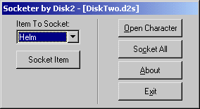



## Diablo 2 Item Socketer Source

### Description

This is the source code to the Diablo 2 Item Socketer I made. I'm just posting it for anybody who doesn't know where to start on a project like this :) I remember how hard it was for me to get started, so I thought I'd make it a little easier for newbies...
 
### More Info
 

             |
---                |---
**Submitted On**   |2000-07-15 19:09:26
**By**             |[Will Brendel](https://github.com/Planet-Source-Code/PSCIndex/blob/master/ByAuthor/will-brendel.md)
**Level**          |Intermediate
**User Rating**    |5.0 (20 globes from 4 users)
**Compatibility**  |VB 3\.0, VB 4\.0 \(16\-bit\), VB 4\.0 \(32\-bit\), VB 5\.0, VB 6\.0, VB Script, ASP \(Active Server Pages\) 
**Category**       |[Miscellaneous](https://github.com/Planet-Source-Code/PSCIndex/blob/master/ByCategory/miscellaneous__1-1.md)
**World**          |[Visual Basic](https://github.com/Planet-Source-Code/PSCIndex/blob/master/ByWorld/visual-basic.md)
**Archive File**   |[CODE\_UPLOAD79497202000\.zip](https://github.com/Planet-Source-Code/will-brendel-diablo-2-item-socketer-source__1-9905/archive/master.zip)

### API Declarations

In the zip...

